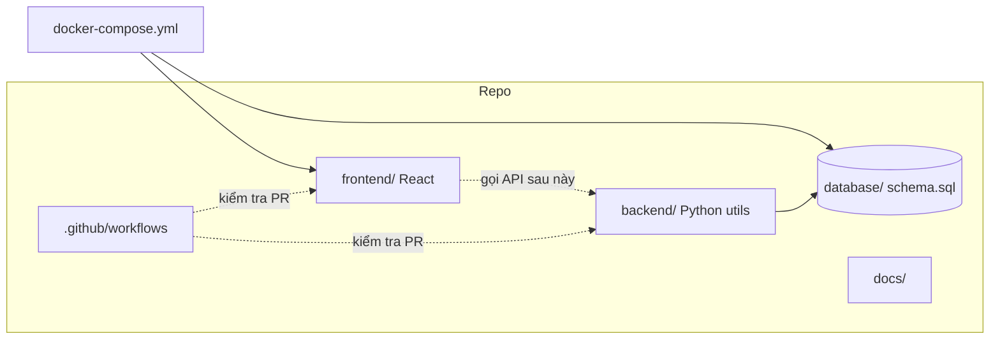

# Hệ thống quản lý thực tập sinh — ICTU

Số hóa quy trình quản lý thực tập sinh: tiếp nhận hồ sơ, phân công mentor, chấm công, giao việc, báo cáo và đánh giá.

**Product Backlog:** [Google Sheets](https://docs.google.com/spreadsheets/d/1jF0gj_Em33a7TeNolltgRWrO9OiZoeYr/edit?gid=405766727#gid=405766727)

## Tài liệu

| Tài liệu | Nội dung |
| --- | --- |
| [docs/software-specification.md](docs/software-specification.md) | **Đặc tả phần mềm (SRS) — chi tiết cho developer** |
| [docs/overview.md](docs/overview.md) | Chi tiết dự án, mục tiêu, vai trò, Epic |
| [docs/flow.md](docs/flow.md) | Luồng nghiệp vụ & luồng làm việc nhóm |
| [docs/git-conventions.md](docs/git-conventions.md) | Quy tắc đặt tên branch & commit |
| [docs/product-backlog.md](docs/product-backlog.md) | Chi tiết 42 User Story |

## Yêu cầu

- Docker & Docker Compose (cách nhanh nhất)
- Hoặc: Python 3.10+, Node.js 22+, Git

## Chạy dự án nhanh (Docker)

```bash
git clone https://github.com/AnLT206/Product_Backlog_Internship_Ictu.git
cd Product_Backlog_Internship_Ictu

cp .env.example .env
docker compose up --build -d
```

Sau khi chạy:

| Service | URL / Port |
| --- | --- |
| Frontend (React + nginx) | http://localhost:8080 |
| MySQL | `localhost:3306` — DB `ictu_internship` / user `ictu` / pass `ictu` |

Dừng:

```bash
docker compose down
```

Reset DB (xóa volume):

```bash
docker compose down -v
```

### Frontend hot-reload (dev)

```bash
docker compose --profile dev up frontend-dev db
```

Mở http://localhost:5173 (Vite). Service `frontend` (nginx :8080) vẫn có thể chạy song song.

## Chạy local (không Docker FE)

```bash
cp .env.example .env
docker compose up -d db

# Backend utils
python3 -m venv venv
source venv/bin/activate
pip install -r backend/requirements.txt

# Frontend
cd frontend
npm ci
npm run dev
```

## Cấu trúc thư mục tổng quan

```text
Product_Backlog_Internship_Ictu/
│
├── .github/
│   └── workflows/
│       └── ci.yml                 # CI: Python + React + Docker validate
│
├── backend/                       # Backend Python
│   ├── requirements.txt           # PyJWT, bcrypt, …
│   └── utils/
│       ├── hash_password.py       # Mã hóa / verify mật khẩu
│       └── authenticate_login.py  # JWT login
│
├── frontend/                      # Frontend React + Vite
│   ├── public/                    # Static assets
│   ├── src/
│   │   ├── assets/                # Ảnh, SVG
│   │   ├── App.jsx                # Component gốc
│   │   ├── App.css
│   │   ├── main.jsx               # Entry
│   │   └── index.css
│   ├── Dockerfile                 # Build nginx production
│   ├── nginx.conf
│   ├── index.html
│   ├── package.json
│   └── vite.config.js
│
├── database/
│   └── schema.sql                 # roles, users, intern_profiles
│
├── docs/                          # Tài liệu dự án
│   ├── software-specification.md  # Đặc tả (SRS) cho developer
│   ├── overview.md
│   ├── flow.md
│   ├── git-conventions.md
│   └── product-backlog.md
│
├── docker-compose.yml             # Stack pbi-ictu: MySQL + Frontend
├── .env.example                   # Mẫu biến môi trường (copy → .env)
├── .gitignore
└── README.md
```

### Sơ đồ quan hệ các phần



| Thư mục / file | Vai trò |
| --- | --- |
| `frontend/` | Giao diện người dùng (React) |
| `backend/` | Logic auth / tiện ích Python (API sẽ mở rộng tại đây) |
| `database/` | Schema MySQL khởi tạo cùng Docker |
| `docs/` | Đặc tả, backlog, quy ước Git |
| `docker-compose.yml` | Chạy nhanh MySQL + FE (`pbi-ictu-*`) |
| `.github/workflows/ci.yml` | CI trước khi merge |

## CI (GitHub Actions)

PR vào `main` → `.github/workflows/ci.yml` chạy song song:

| Job | Kiểm tra |
| --- | --- |
| **Backend (Python)** | Cài deps + `compileall` |
| **Frontend (React)** | `npm ci` + lint + build |
| **Docker Compose config** | `docker compose config` hợp lệ |

CI fail → không merge. Branch protection: bật **Require status checks** cho các job trên.

## Đóng góp

1. Tạo branch từ `main` theo [quy tắc đặt tên](docs/git-conventions.md).
2. Commit theo [quy tắc commit](docs/git-conventions.md).
3. Mở PR vào `main`, chờ CI pass rồi merge.

## Tác giả / Nhóm

[AnLT206](https://github.com/AnLT206)
