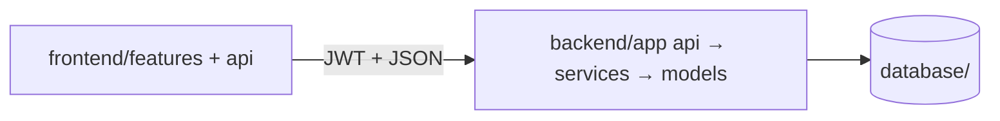

# Hệ thống quản lý thực tập sinh — ICTU

Số hóa quy trình quản lý thực tập sinh: tiếp nhận hồ sơ, phân công mentor, chấm công, giao việc, báo cáo và đánh giá.

**Product Backlog:** [Google Sheets](https://docs.google.com/spreadsheets/d/1jF0gj_Em33a7TeNolltgRWrO9OiZoeYr/edit?gid=405766727#gid=405766727)

## Tài liệu

| Tài liệu | Nội dung |
| --- | --- |
| [docs/software-specification.md](docs/software-specification.md) | **Đặc tả phần mềm (SRS) — chi tiết cho developer** |
| [docs/folder-structure.md](docs/folder-structure.md) | **Cấu trúc thư mục chuẩn — cả nhóm phải bám** |
| [docs/overview.md](docs/overview.md) | Chi tiết dự án, mục tiêu, vai trò, Epic |
| [docs/flow.md](docs/flow.md) | Luồng nghiệp vụ & luồng làm việc nhóm |
| [docs/git-conventions.md](docs/git-conventions.md) | Quy tắc đặt tên branch & commit |
| [docs/product-backlog.md](docs/product-backlog.md) | Chi tiết 42 User Story |

## Yêu cầu

- Docker & Docker Compose (cách nhanh nhất)
- Hoặc: Python 3.10+, Node.js 22+, Git

## Chạy dự án nhanh (Docker)

```bash
git clone https://github.com/AnLT206/Product_Backlog_Internship_Ictu.git
cd Product_Backlog_Internship_Ictu

cp .env.example .env
docker compose up --build -d
```

Sau khi chạy:

| Service | URL / Port |
| --- | --- |
| Backend API (FastAPI) | http://localhost:8000 — docs: `/docs` |
| Frontend (React + nginx) | http://localhost:8080 |
| MySQL | `localhost:3306` — DB `ictu_internship` / user `ictu` / pass `ictu` |
| Admin (dev, seed tự động) | `admin@ictu.edu.vn` / `Admin@123` — tắt bằng `ADMIN_SEED_ON_STARTUP=false` |

**Tài khoản admin cố định cho cả team:**

| Lần chạy | Hành vi |
| --- | --- |
| `docker compose up` lần đầu / DB trống | Tự tạo `admin@ictu.edu.vn` / `Admin@123` (role admin, active) |
| `up` lần sau (giữ volume) | **Giữ nguyên** nick đó — không tạo trùng, không đổi mật khẩu |
| `docker compose down -v` rồi `up` lại | Xóa hết data → seed tạo lại đúng nick cố định |

Backend Docker sẽ **tự seed admin** trước khi mở API (idempotent). Volume DB mới cũng chạy `database/seeds/002_admin_user.sql`.

Dừng:

```bash
docker compose down
```

Reset DB (xóa volume):

```bash
docker compose down -v
```

### Frontend hot-reload (dev)

```bash
docker compose --profile dev up frontend-dev db
```

Mở http://localhost:5173 (Vite). Service `frontend` (nginx :8080) vẫn có thể chạy song song.

## Chạy local (không Docker FE)

```bash
cp .env.example .env
docker compose up -d db

# Backend utils
python3 -m venv venv
source venv/bin/activate
pip install -r backend/requirements.txt

# Chạy API đăng ký (từ thư mục backend/)
cd backend
uvicorn app.main:app --reload --port 8000
# Docs: http://localhost:8000/docs
# POST /api/auth/register  (chỉ TTS / intern — không dùng cho HR/mentor)

# Seed tài khoản admin (dev) — chạy 1 lần sau khi DB sẵn sàng
# PYTHONPATH=. python -m scripts.seed_admin
# Mặc định: admin@ictu.edu.vn / Admin@123  (đổi qua .env ADMIN_SEED_*)
# Hoặc SQL: mysql ... < database/seeds/001_roles.sql
#            mysql ... < database/seeds/002_admin_user.sql

# Frontend
cd frontend
npm ci
npm run dev
```

## Cấu trúc thư mục chuẩn (mục tiêu — cả nhóm bám theo)

> **Quan trọng:** Đây là cấu trúc **chuẩn cần đạt**, không phải mirror 100% thư mục đang có.  
> Code mới phải đặt đúng chỗ. Chi tiết + quy tắc chia file: **[docs/folder-structure.md](docs/folder-structure.md)**.

```text
Product_Backlog_Internship_Ictu/
├── .github/workflows/ci.yml
│
├── backend/                          # Python API
│   ├── app/
│   │   ├── main.py                   # Entry API
│   │   ├── api/routes/               # Endpoint (auth, interns, tasks…)
│   │   ├── core/                     # config, database, security
│   │   ├── models/                   # ORM / bảng
│   │   ├── schemas/                  # Request / response
│   │   ├── services/                 # Business logic
│   │   └── utils/                    # Helper (hash, jwt…)
│   ├── tests/
│   └── requirements.txt
│
├── frontend/                         # React + Vite
│   ├── public/
│   ├── src/
│   │   ├── api/                      # Gọi backend
│   │   ├── components/common/        # UI dùng chung
│   │   ├── features/                 # Theo nghiệp vụ: auth, interns, tasks…
│   │   ├── layouts/                  # Layout theo role
│   │   ├── routes/                   # Router + guard
│   │   ├── hooks/ | context/ | utils/ | styles/ | assets/
│   │   ├── App.jsx
│   │   └── main.jsx
│   ├── Dockerfile
│   └── package.json
│
├── database/
│   ├── schema.sql
│   ├── migrations/                   # (tuỳ chọn)
│   └── seeds/                        # Data mẫu (roles…)
│
├── docs/                             # SRS, cấu trúc chuẩn, backlog…
├── docker-compose.yml
├── .env.example
└── README.md
```



| Đang lệch / thiếu | Việc nhóm cần làm |
| --- | --- |
| `backend/` đã có register API (TTS) | Tiếp: login, me, upload documents |
| Seed admin (dev) | Docker backend tự seed; hoặc `PYTHONPATH=. python -m scripts.seed_admin` → `admin@ictu.edu.vn` / `Admin@123` |
| `frontend/` đã có `features/auth/` | Bổ sung `api/`, `layouts/`, `routes/` khi làm màn hình |
| Seed roles trong `schema.sql` | DB volume cũ: chạy `database/migrate_register.sql` |

## CI (GitHub Actions)

PR vào `main` → `.github/workflows/ci.yml` chạy song song:

| Job | Kiểm tra |
| --- | --- |
| **Backend (Python)** | Cài deps + `compileall` + pytest validate |
| **Frontend (React)** | `npm ci` + lint + build |
| **Docker Compose config** | `docker compose config` hợp lệ |

CI fail → không merge. Branch protection: bật **Require status checks** cho các job trên.

## Đóng góp

1. Tạo branch từ `main` theo [quy tắc đặt tên](docs/git-conventions.md).
2. Đặt file đúng [cấu trúc thư mục chuẩn](docs/folder-structure.md).
3. Commit theo [quy tắc commit](docs/git-conventions.md).
4. Mở PR vào `main`, chờ CI pass rồi merge.

## Tác giả / Nhóm

[AnLT206](https://github.com/AnLT206)
