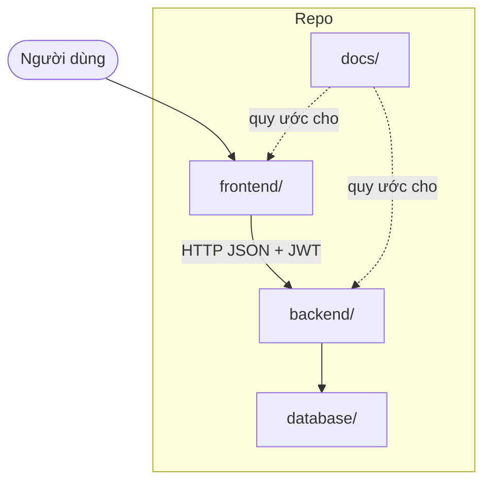

# Cấu trúc thư mục chuẩn (chuẩn nhóm phải bám)

**Đây là cấu trúc mục tiêu.** Code mới / refactor phải đặt file đúng chỗ theo tài liệu này.  
Trạng thái hiện tại còn thiếu nhiều thư mục — dần dần chuyển về chuẩn này, **không** tạo folder lung tung ngoài quy ước.

---

## 1. Tổng quan monorepo

```text
Product_Backlog_Internship_Ictu/
│
├── .github/workflows/          # CI/CD GitHub Actions
├── backend/                    # API + business logic (Python)
├── frontend/                   # UI (React + Vite)
├── database/                   # SQL schema / migration / seed
├── docs/                       # Tài liệu (SRS, backlog, quy ước)
├── docker-compose.yml
├── .env.example                # Không commit .env thật
├── .gitignore
└── README.md
```



| Tầng | Công nghệ | Ai làm việc chính |
| --- | --- | --- |
| `frontend/` | React + Vite | FE |
| `backend/` | Python (API) | BE |
| `database/` | MySQL SQL | BE / full-stack |
| `docs/` | Markdown | Cả nhóm |

---

## 2. Chuẩn `backend/`

```text
backend/
├── app/
│   ├── __init__.py
│   ├── main.py                 # Entry FastAPI/Flask — tạo app, CORS, include router
│   │
│   ├── api/                    # Chỉ nhận request / trả response
│   │   ├── __init__.py
│   │   ├── deps.py             # get_db, get_current_user, require_role
│   │   └── routes/
│   │       ├── __init__.py
│   │       ├── auth.py         # /api/auth/*
│   │       ├── interns.py      # /api/hr/interns, /api/intern/...
│   │       ├── programs.py
│   │       ├── tasks.py
│   │       ├── attendance.py
│   │       └── admin.py
│   │
│   ├── core/                   # Config dùng chung
│   │   ├── __init__.py
│   │   ├── config.py           # Đọc .env
│   │   ├── database.py         # Engine, Session
│   │   └── security.py         # JWT, hash wrapper
│   │
│   ├── models/                 # ORM / table mapping
│   │   ├── __init__.py
│   │   ├── user.py
│   │   ├── role.py
│   │   ├── intern_profile.py
│   │   └── ...
│   │
│   ├── schemas/                # Pydantic request/response
│   │   ├── __init__.py
│   │   ├── auth.py
│   │   ├── user.py
│   │   └── ...
│   │
│   ├── services/               # Business logic (không phụ thuộc HTTP)
│   │   ├── __init__.py
│   │   ├── auth_service.py
│   │   ├── intern_service.py
│   │   └── ...
│   │
│   └── utils/                  # Helper thuần (đã có)
│       ├── hash_password.py
│       └── authenticate_login.py
│
├── tests/                      # Test backend
│   ├── test_auth.py
│   └── ...
├── requirements.txt
└── Dockerfile                  # (khi đóng gói API)
```

### Quy tắc đặt file backend

| Loại code | Đặt vào | Ví dụ |
| --- | --- | --- |
| Endpoint / router | `app/api/routes/` | `auth.py` → login, register |
| Đọc `.env`, DB session | `app/core/` | `config.py`, `database.py` |
| Entity / bảng | `app/models/` | `User`, `InternProfile` |
| Validate body/response | `app/schemas/` | `LoginRequest` |
| Nghiệp vụ phức tạp | `app/services/` | duyệt hồ sơ, chấm công |
| Hàm nhỏ tái sử dụng | `app/utils/` | hash, format date |
| Test | `backend/tests/` | |

**Không:** nhét logic duyệt hồ sơ vào `utils/`, không viết SQL dài trong router.

### Map code hiện có → chuẩn

| Hiện tại | Chuyển dần sang |
| --- | --- |
| `backend/utils/hash_password.py` | `backend/app/utils/hash_password.py` (hoặc gọi từ `core/security.py`) |
| `backend/utils/authenticate_login.py` | `backend/app/utils/` + logic login trong `services/auth_service.py` |
| (chưa có) | Tạo `app/main.py`, `api/`, `models/`, `schemas/` khi làm API |

---

## 3. Chuẩn `frontend/`

```text
frontend/
├── public/                     # file tĩnh (favicon, …)
├── src/
│   ├── main.jsx                # Entry
│   ├── App.jsx                 # Root + Provider
│   │
│   ├── api/                    # Gọi backend (axios/fetch)
│   │   ├── client.js           # baseURL, gắn JWT
│   │   ├── auth.js
│   │   ├── interns.js
│   │   └── ...
│   │
│   ├── components/             # Component dùng chung (Button, Modal, Table…)
│   │   └── common/
│   │
│   ├── features/               # Theo nghiệp vụ (khuyến nghị)
│   │   ├── auth/
│   │   │   ├── LoginPage.jsx
│   │   │   ├── RegisterPage.jsx
│   │   │   └── components/
│   │   ├── interns/            # HR quản lý hồ sơ
│   │   ├── programs/
│   │   ├── tasks/
│   │   ├── attendance/
│   │   └── admin/
│   │
│   ├── layouts/                # Layout theo role
│   │   ├── InternLayout.jsx
│   │   ├── HrLayout.jsx
│   │   ├── MentorLayout.jsx
│   │   └── AdminLayout.jsx
│   │
│   ├── routes/                 # Khai báo router + guard theo role
│   │   └── index.jsx
│   │
│   ├── hooks/                  # Custom hooks
│   ├── context/                # AuthContext, … (hoặc store/)
│   ├── constants/              # role name, status enum
│   ├── utils/                  # format date, validate form
│   ├── styles/                 # CSS/SCSS global, theme
│   └── assets/                 # ảnh, icon
│
├── Dockerfile
├── nginx.conf
├── index.html
├── package.json
├── vite.config.js
└── eslint.config.js
```

### Quy tắc đặt file frontend

| Loại | Đặt vào |
| --- | --- |
| Trang / màn hình theo US | `src/features/<domain>/` |
| Component tái sử dụng nhiều trang | `src/components/common/` |
| Gọi API | `src/api/` — **không** `fetch` rải trong mọi component |
| Layout sidebar/header theo role | `src/layouts/` |
| Route + bảo vệ JWT/role | `src/routes/` |
| Ảnh, logo | `src/assets/` |

**Không:** để toàn bộ logic trong `App.jsx`; không tạo thư mục `pages/` lẫn `features/` cùng lúc (chọn **một** style — nhóm chọn `features/`).

---

## 4. Chuẩn `database/`

```text
database/
├── schema.sql                  # Schema tổng (dev / docker init)
├── migrations/                 # (tuỳ chọn) từng file ALTER theo thời gian
│   ├── 001_init.sql
│   └── 002_add_documents.sql
└── seeds/                      # Data mẫu
    └── 001_roles.sql           # seed intern, hr, mentor, admin
```

- Đổi cấu trúc bảng → cập nhật `schema.sql` **và** (nếu dùng) thêm file trong `migrations/`.
- Không sửa DB production bằng tay mà quên commit SQL.

---

## 5. Chuẩn `docs/`

```text
docs/
├── software-specification.md   # Đặc tả cho dev
├── folder-structure.md         # File này — cấu trúc chuẩn
├── overview.md
├── flow.md
├── git-conventions.md
└── product-backlog.md
```

---

## 6. Ai làm feature thì tạo file ở đâu? (ví dụ)

| User Story | Backend | Frontend |
| --- | --- | --- |
| US 6 Đăng ký TTS | `api/routes/auth.py` + `services/auth_service.py` + `schemas/auth.py` | `features/auth/RegisterPage.jsx` + `api/auth.js` |
| US 7 HR duyệt | `api/routes/interns.py` + `services/intern_service.py` | `features/interns/InternDetailPage.jsx` |
| US 21 Chấm công | `api/routes/attendance.py` + model `attendance` | `features/attendance/AttendancePage.jsx` |
| US 39 Admin user | `api/routes/admin.py` | `features/admin/UsersPage.jsx` |

---

## 7. Checklist trước khi mở PR

- [ ] File nằm đúng tầng (`routes` / `services` / `features` / …)
- [ ] Không nhét business logic vào `utils/` trừ helper thuần
- [ ] FE gọi API qua `src/api/`, không hard-code URL lung tung
- [ ] SQL mới nằm trong `database/`
- [ ] Không commit `.env`, `node_modules/`, `venv/`

---

## 8. Lộ trình chuyển từ hiện tại → chuẩn

1. **Giữ** `backend/utils/*` đang chạy — khi dựng API, bọc vào `app/` như bảng map mục 2.  
2. **Khi làm màn hình tiếp theo** (login, dashboard…): đặt vào `frontend/src/features/<domain>/`, gọi API qua `src/api/`.  
   *(FE đã có khung thư mục chuẩn; form đăng ký hiện tại nằm tại `features/auth/` — chỉ đổi vị trí, không thêm logic.)*
3. **Không** tạo thêm `backend/helpers/`, `frontend/misc/`, `temp/` ngoài chuẩn.  
4. Refactor folder cũ theo từng PR nhỏ (`refactor/...`), không move cả repo một lần nếu đang có PR song song.
