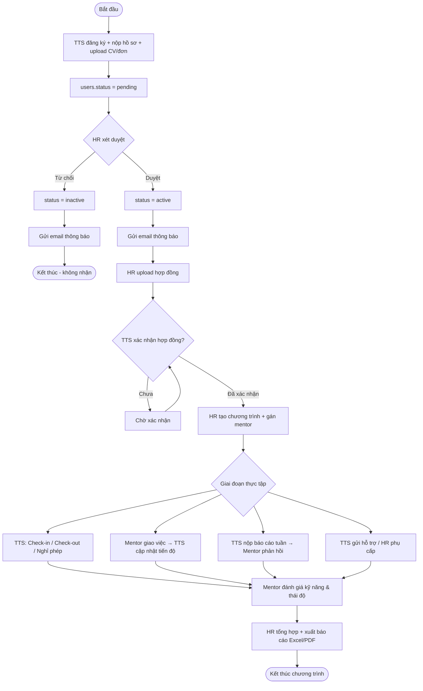
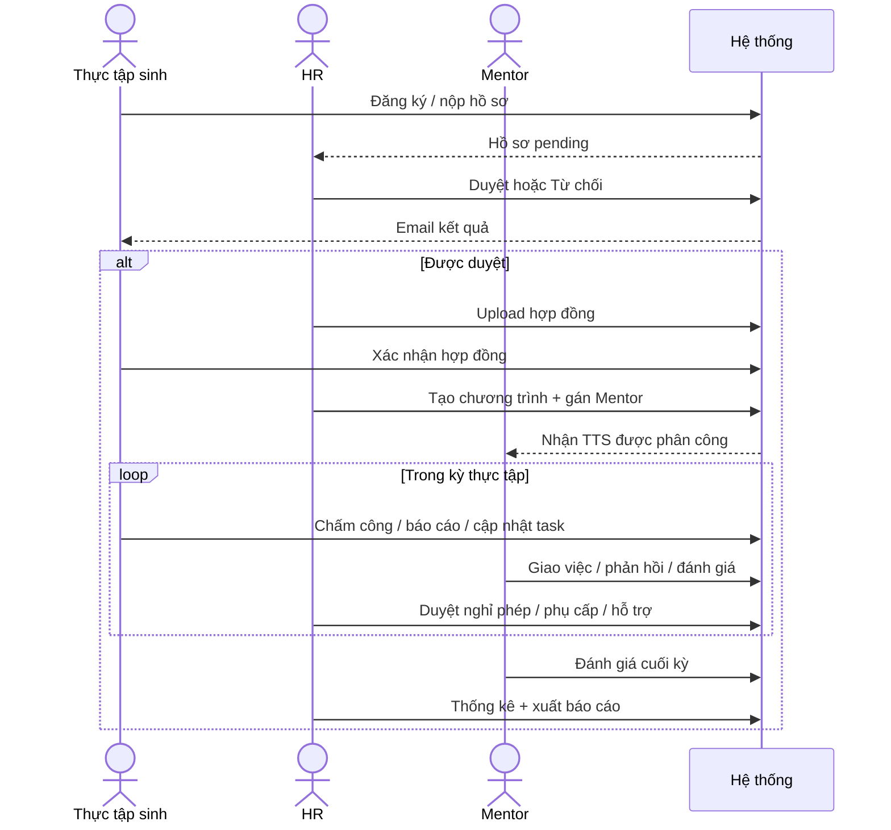
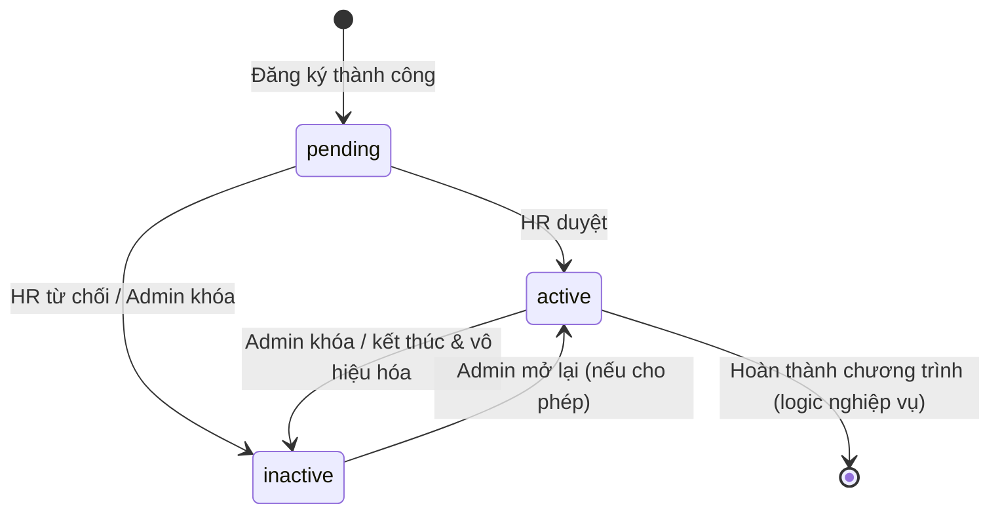

# Đặc tả phần mềm — Hướng dẫn cho Developer

**Hệ thống:** Quản lý thực tập sinh — ICTU  
**Phiên bản:** 2.1 (dành cho lập trình viên)  
**Ngày:** 2026-09-23  
**Backlog:** [Google Sheets](https://docs.google.com/spreadsheets/d/1jF0gj_Em33a7TeNolltgRWrO9OiZoeYr/edit?gid=405766727#gid=405766727)

---

## Cách đọc tài liệu này

Mỗi chức năng được viết theo khung:

1. **Dev phải làm gì** — FE / BE / DB  
2. **Luồng người dùng** — từng bước bấm / điền  
3. **Màn hình** — URL, ô nhập, nút  
4. **API** — method, path, request/response  
5. **Quy tắc nghiệp vụ** — validate, trạng thái  
6. **Done khi nào** — checklist nghiệm thu  

**Đã có trong repo (đừng làm lại):**

| File | Việc đã xong |
| --- | --- |
| `database/schema.sql` | Bảng `roles`, `users`, `intern_profiles` |
| `backend/app/utils/hash_password.py` | Hash / verify bcrypt |
| `backend/app/utils/authenticate_login.py` | Tạo / verify JWT, login helper |
| `docker-compose.yml` + `.env.example` | MySQL local |
| `.github/workflows/ci.yml` | CI kiểm tra cú pháp Python |

**Chưa có — cần làm:** REST API, frontend, upload file, email, các bảng Epic còn lại.

---

## 1. Bức tranh tổng thể

### 1.1. Tầm nhìn

Số hóa tuyển chọn → quản lý → đánh giá thực tập sinh; TTS có trải nghiệm minh bạch.

### 1.2. Vai trò (seed vào bảng `roles`)

| `roles.name` | Ai | Sau login vào đâu |
| --- | --- | --- |
| `intern` | Thực tập sinh | `/intern/dashboard` |
| `mentor` | Mentor | `/mentor/dashboard` |
| `hr` | HR | `/hr/dashboard` |
| `admin` | Admin | `/admin/dashboard` |

### 1.3. Luồng hoạt động chính (end-to-end)

#### 1.3.1. Sơ đồ tổng quan vòng đời thực tập sinh



#### 1.3.2. Sơ đồ theo vai trò (ai làm gì)



#### 1.3.3. Sơ đồ trạng thái tài khoản TTS



#### 1.3.4. Tóm tắt chữ (đối chiếu nhanh)

```text
TTS đăng ký (pending)
    → HR duyệt (active) / từ chối (inactive)
    → HR upload hợp đồng → TTS xác nhận
    → HR tạo chương trình + gán mentor
    → TTS chấm công / làm task / báo cáo
    → Mentor phản hồi / đánh giá
    → HR thống kê + xuất báo cáo
```

### 1.4. Kiến trúc đề xuất cho team

```text
[Browser FE]
     │  JSON + Bearer JWT
     ▼
[Backend API Python]  ← dùng lại hash_password + authenticate_login
     │
     ▼
[MySQL 8]
```

- Auth header: `Authorization: Bearer <access_token>`  
- Response lỗi thống nhất: `{ "detail": "..." }` + HTTP status  
- Phân trang: `?page=1&page_size=20` → `{ items, total, page, page_size }`

---

## 2. Chuẩn chung cho mọi API / form

### 2.1. HTTP status

| Code | Khi nào dùng |
| --- | --- |
| 200 | Thành công (GET/PUT/PATCH) |
| 201 | Tạo mới (POST) |
| 400 | Validate fail |
| 401 | Chưa login / JWT sai / hết hạn |
| 403 | Sai role / không đủ quyền |
| 404 | Không tìm thấy |
| 409 | Trùng (email đã tồn tại…) |
| 422 | Body không đúng schema |

### 2.2. Validation chung

| Trường | Rule |
| --- | --- |
| Email | Đúng format, unique trong `users` |
| Password | ≥ 6 ký tự; lưu **hash bcrypt** (dùng `hash_password`) |
| File upload | PDF/DOC/DOCX; max **5MB** (thống nhất team) |
| Date range | `start_date` ≤ `end_date` |
| JWT | Secret từ `JWT_SECRET_KEY` trong `.env` |

### 2.3. `users.status`

| Giá trị | Ý nghĩa | Login được? |
| --- | --- | --- |
| `pending` | Mới đăng ký, chờ HR duyệt | Có (xem trạng thái) hoặc chặn chức năng thực tập — **chọn 1 và áp dụng thống nhất**: khuyến nghị **cho login nhưng chỉ xem “chờ duyệt”** |
| `active` | Đã duyệt | Đầy đủ quyền theo role |
| `inactive` | Từ chối / khóa | Không login (401/403) |

---

## 3. MODULE AUTH (nền — làm trước)

### 3.1. Dev phải làm gì

| Layer | Việc |
| --- | --- |
| BE | `POST /api/auth/login`, `POST /api/auth/register`, `GET /api/auth/me` |
| BE | Gọi sẵn `hash_password`, `verify_password`, `create_access_token`, `verify_access_token` |
| FE | Trang `/login`, `/register`, lưu token (memory/localStorage), gắn header mọi request |
| DB | Seed 4 roles nếu chưa có |

### 3.2. Màn hình Đăng nhập — `/login`

| UI | Loại | Bắt buộc |
| --- | --- | :---: |
| Email | input | ✓ |
| Mật khẩu | password | ✓ |
| **Đăng nhập** | button | |
| Link “Đăng ký thực tập” | link → `/register` | |

**Luồng:** điền → bấm Đăng nhập → gọi API → lưu JWT → redirect theo role.

**API**

```http
POST /api/auth/login
Content-Type: application/json

{ "email": "a@example.com", "password": "Secret123" }
```

Response 200:

```json
{
  "access_token": "<jwt>",
  "token_type": "bearer",
  "user": { "id": 1, "email": "a@example.com", "full_name": "...", "role": "hr", "status": "active" }
}
```

### 3.3. API lấy user hiện tại

```http
GET /api/auth/me
Authorization: Bearer <jwt>
```

→ 200: thông tin user + role. Dùng để bảo vệ route FE.

### 3.4. Done khi

- [ ] Login đúng → có JWT; sai password → 401  
- [ ] `inactive` → không vào được hệ thống  
- [ ] FE redirect đúng dashboard theo role  
- [ ] Không lộ `password_hash` ra response  

---

## 4. MODULE ĐĂNG KÝ TTS (US 6, 4) — Epic 2 + 1

### 4.1. Dev phải làm gì

| Layer | Việc |
| --- | --- |
| DB | Dùng `users` + `intern_profiles`; **thêm** bảng `documents` (CV, đơn) |
| BE | `POST /api/auth/register` (multipart hoặc 2 bước: đăng ký + upload) |
| FE | Form `/register` |

### 4.2. Bảng `documents` (cần tạo)

```sql
-- Gợi ý schema — dev implement trong database/schema.sql hoặc migration
CREATE TABLE documents (
  id INT AUTO_INCREMENT PRIMARY KEY,
  user_id INT NOT NULL,
  doc_type ENUM('cv', 'application', 'contract', 'other') NOT NULL,
  file_name VARCHAR(255) NOT NULL,
  file_path VARCHAR(500) NOT NULL,
  status ENUM('pending', 'approved', 'rejected') DEFAULT 'pending',
  review_note VARCHAR(255) NULL,
  created_at TIMESTAMP DEFAULT CURRENT_TIMESTAMP,
  FOREIGN KEY (user_id) REFERENCES users(id) ON DELETE CASCADE
);
```

### 4.3. Màn hình `/register`

**Nhóm A — Tài khoản**

| Ô | Map DB | Bắt buộc |
| --- | --- | :---: |
| Họ tên | `users.full_name` | ✓ |
| Email | `users.email` | ✓ |
| Mật khẩu | → `password_hash` | ✓ |
| Xác nhận mật khẩu | chỉ FE | ✓ (khớp) |

**Nhóm B — Hồ sơ**

| Ô | Map DB | Bắt buộc |
| --- | --- | :---: |
| SĐT | `intern_profiles.phone_number` | |
| Ngày sinh | `dob` | |
| Giới tính | `gender` (male/female/other) | |
| Trường | `university` | ✓ |
| Ngành | `major` | ✓ |
| Năm học | `academic_year` | |
| GPA | `gpa` | |
| Địa chỉ | `address` | |

**Nhóm C — File**

| Ô | doc_type | Bắt buộc |
| --- | --- | :---: |
| Upload CV | `cv` | ✓ |
| Upload đơn xin TT | `application` | ✓ |

**Nút:** **Gửi hồ sơ đăng ký** | **Hủy**

### 4.4. Luồng xử lý BE khi đăng ký

1. Validate email chưa tồn tại → else 409.  
2. `password_hash = hash_password(password)`.  
3. Insert `users`: `role_id = intern`, `status = pending`.  
4. Insert `intern_profiles` với `user_id`.  
5. Lưu 2 file → insert `documents`.  
6. Response 201 + (optional) không auto-login, bảo về `/login`.

### 4.5. Done khi

- [ ] Đăng ký thành công → có user pending + profile + 2 documents  
- [ ] Email trùng → 409, FE hiện lỗi rõ  
- [ ] Password không lưu plain text  
- [ ] File sai định dạng / quá size → 400  

---

## 5. MODULE HR — HỒ SƠ & XÉT DUYỆT (US 1–3, 5, 7–8)

### 5.1. Dev phải làm gì

| API | Mô tả | Role |
| --- | --- | --- |
| `GET /api/hr/interns` | Danh sách + filter | hr, admin |
| `POST /api/hr/interns` | Thêm hồ sơ hộ (US 1) | hr |
| `GET /api/hr/interns/{id}` | Chi tiết + documents | hr |
| `PUT /api/hr/interns/{id}` | Sửa hồ sơ (US 2) | hr |
| `POST /api/hr/interns/{id}/approve` | Duyệt (US 7) | hr |
| `POST /api/hr/interns/{id}/reject` | Từ chối + note | hr |
| `POST /api/hr/documents/{id}/review` | Duyệt/từ chối file (US 5) | hr |

Query list: `?university=&major=&status=&q=&page=`

### 5.2. Màn hình `/hr/interns`

| UI | Mô tả |
| --- | --- |
| Ô tìm kiếm | Tên / email (`q`) |
| Select Trường, Ngành, Trạng thái | Filter |
| Nút **Tìm**, **Xóa lọc**, **Thêm hồ sơ** | |
| Bảng | Họ tên, Email, Trường, Ngành, Status, Ngày tạo, **Xem** / **Sửa** |

### 5.3. Màn hình `/hr/interns/{id}`

1. Block thông tin cá nhân + nút **Sửa**.  
2. Block tài liệu: mỗi file có **Tải về**, **Duyệt**, **Từ chối** (+ ô ghi chú).  
3. Block quyết định hồ sơ:
   - Textarea ghi chú  
   - Nút **Duyệt hồ sơ** → `status=active` + gửi email (US 8)  
   - Nút **Từ chối** → `status=inactive` + email  

### 5.4. Quy tắc

- Chỉ duyệt khi đang `pending`.  
- Từ chối bắt buộc có `note` (khuyến nghị).  
- Email: có thể stub log ra console giai đoạn 1; sau đó SMTP thật.

### 5.5. Done khi

- [ ] Filter trường/ngành đúng (US 3)  
- [ ] Duyệt/từ chối đổi status đúng  
- [ ] TTS thấy trạng thái tài liệu sau khi HR review  
- [ ] Role khác hr/admin gọi API → 403  

---

## 6. MODULE HỢP ĐỒNG (US 9–10)

### 6.1. Dev phải làm gì

| API | Ai |
| --- | --- |
| `POST /api/hr/interns/{id}/contract` (upload file, doc_type=`contract`) | HR |
| `GET /api/intern/contract` | TTS |
| `POST /api/intern/contract/confirm` | TTS |

Cần thêm cột (hoặc bảng `contracts`): `confirmed_at DATETIME NULL`.

### 6.2. UI

**HR:** trên trang chi tiết TTS — chọn file + **Tải lên hợp đồng**.  
**TTS `/intern/contract`:** xem/tải file + checkbox “Đã đọc và đồng ý” + **Xác nhận hợp đồng** (disable nếu chưa tick).

### 6.3. Done khi

- [ ] Chỉ TTS đã `active` mới confirm  
- [ ] Confirm 1 lần; HR thấy đã xác nhận + thời điểm  

---

## 7. MODULE CHƯƠNG TRÌNH & MENTOR (US 11–14, 29–31)

### 7.1. Bảng cần tạo

- `programs` — name, department, description, start_date, end_date  
- `program_members` — program_id, intern_user_id, mentor_user_id  

### 7.2. API (role hr)

| Method | Path | Việc |
| --- | --- | --- |
| GET/POST | `/api/hr/programs` | List / tạo chương trình |
| PUT | `/api/hr/programs/{id}` | Sửa (kể cả ngày) |
| POST | `/api/hr/programs/{id}/assign` | Body: `{ intern_ids[], mentor_id }` |
| GET/POST | `/api/hr/mentors` | List / tạo mentor (tạo user role mentor) |
| GET | `/api/hr/mentors/workload` | Đếm số TTS / mentor |

TTS: `GET /api/intern/schedule` — chỉ lịch của mình.

### 7.3. UI chính

| Trang | Ô / nút chính |
| --- | --- |
| `/hr/programs/new` | Tên*, Phòng ban*, Mô tả, Start*, End*, **Lưu** |
| `/hr/programs/{id}/assign` | Multi-select TTS, Select mentor, **Gán** |
| `/hr/mentors` | **Thêm mentor** (họ tên, email, password tạm), cột “Số TTS” |
| `/intern/schedule` | Chỉ đọc: chương trình, ngày, mentor |

### 7.4. Done khi

- [ ] start ≤ end  
- [ ] Mentor chỉ thấy TTS được gán cho mình  
- [ ] Workload đếm đúng  

---

## 8. MODULE NHIỆM VỤ / BÁO CÁO / ĐÁNH GIÁ (US 15–20)

### 8.1. Bảng

- `tasks` — mentor_id, intern_id, title, description, due_at, status (`todo`/`doing`/`done`), progress (0–100)  
- `weekly_reports` — intern_id, week_start, week_end, content, attachment_path, created_at  
- `report_feedbacks` — report_id, mentor_id, content  
- `evaluations` — intern_id, mentor_id, skill_score, attitude_score, comment  

### 8.2. API tóm tắt

| Ai | API |
| --- | --- |
| Mentor | `POST /api/mentor/tasks`, `GET /api/mentor/tasks` |
| TTS | `PATCH /api/intern/tasks/{id}` (status, progress, note) |
| TTS | `POST /api/intern/reports` |
| Mentor | `POST /api/mentor/reports/{id}/feedback` |
| Mentor | `POST /api/mentor/evaluations` |
| HR | `GET /api/hr/evaluations/summary` |

### 8.3. UI — Mentor giao việc `/mentor/tasks/new`

| Ô | Bắt buộc |
| --- | :---: |
| Select TTS (chỉ TTS mình phụ trách) | ✓ |
| Tiêu đề | ✓ |
| Mô tả | |
| Hạn | ✓ |
| Ưu tiên | |
| Nút **Giao việc** | |

TTS cập nhật: Select trạng thái + % + **Lưu**.

### 8.4. Done khi

- [ ] Mentor không giao task cho TTS không thuộc mình (403)  
- [ ] TTS không sửa task của người khác  
- [ ] Feedback hiện được phía TTS  

---

## 9. MODULE CHẤM CÔNG & NGHỈ PHÉP (US 21–24)

### 9.1. Bảng

- `attendance` — user_id, work_date, check_in_at, check_out_at  
- `leave_requests` — user_id, from_date, to_date, reason, status (`pending`/`approved`/`rejected`)  
- `work_schedules` — program_id, weekday, start_time, end_time  

### 9.2. API

| Path | Ai | Việc |
| --- | --- | --- |
| `POST /api/intern/attendance/check-in` | TTS | 1 lần/ngày |
| `POST /api/intern/attendance/check-out` | TTS | Sau check-in |
| `GET /api/intern/attendance` | TTS | Lịch sử |
| `GET /api/hr/attendance` | HR | Filter ngày + TTS |
| `POST /api/intern/leave` | TTS | Xin nghỉ |
| `POST /api/hr/leave/{id}/approve\|reject` | HR | Duyệt |
| `PUT /api/hr/work-schedules` | HR | Lịch làm việc |

### 9.3. UI TTS `/intern/attendance`

- Badge trạng thái hôm nay  
- Nút **Check-in** / **Check-out** (enable đúng lúc)  
- Bảng lịch sử  

**Rule:** không check-out nếu chưa check-in; không check-in 2 lần cùng ngày.

### 9.4. Done khi

- [ ] Đủ rule trên  
- [ ] HR lọc được báo cáo chuyên cần  

---

## 10. MODULE PHỤ CẤP & HỖ TRỢ (US 25–28)

### 10.1. Bảng

- `allowances` — intern_id, period (YYYY-MM), amount, note, created_by  
- `support_tickets` — intern_id, type, description, status, hr_response  

### 10.2. UI / API nhanh

| Ai | Làm gì |
| --- | --- |
| HR | Form: TTS + kỳ + số tiền → `POST /api/hr/allowances` |
| TTS | Chỉ GET lịch sử phụ cấp của mình |
| TTS | Form hỗ trợ: loại* + mô tả* + file → `POST /api/intern/support` |
| HR | Duyệt ticket: phản hồi + status |

---

## 11. MODULE THỐNG KÊ (US 32–34)

### 11.1. Dev phải làm gì

| API | Kết quả |
| --- | --- |
| `GET /api/hr/stats/by-university` | Đếm TTS theo trường |
| `GET /api/hr/stats/by-major` | Đếm theo ngành |
| `GET /api/hr/stats/completion-rate` | (số hoàn thành / tổng) * 100 — **định nghĩa “hoàn thành” = có evaluation hoặc status chương trình done** (team chốt 1 công thức) |
| `GET /api/hr/stats/export?format=xlsx\|pdf` | File download |

### 11.2. UI `/hr/analytics`

Filter + chart/bảng + nút **Xuất Excel** / **Xuất PDF**.

---

## 12. MODULE THÔNG BÁO & TÍCH HỢP (US 35–38) — giai đoạn sau

| Việc | Dev làm |
| --- | --- |
| Bảng `notifications` | user_id, title, body, is_read, created_at |
| Job email lịch họp | Cron + SMTP |
| FE chuông | Badge + list + đánh dấu đã đọc |
| Admin integrations | Form config HRM / QR — stub interface trước |

---

## 13. MODULE ADMIN (US 39–42)

| API / UI | Việc |
| --- | --- |
| `/admin/users` | CRUD user, gán role, khóa/mở (`inactive`/`active`) |
| `/admin/roles` | Ma trận permission (checkbox theo module) — có thể hardcode permission map giai đoạn 1 |
| `/admin/audit-logs` | Ghi log khi approve/reject/login fail/đổi role |
| Backup | Script `mysqldump` theo cron (US 41) |

Mọi API admin: chỉ role `admin` → else 403.

---

## 14. Ma trận quyền (implement middleware)

| Module | intern | mentor | hr | admin |
| --- | :---: | :---: | :---: | :---: |
| Register (public) | ✓ | | | |
| Login (public) | ✓ | ✓ | ✓ | ✓ |
| Hồ sơ / duyệt | own | | ✓ | ✓ |
| Chương trình / gán mentor | xem lịch | xem TTS của mình | ✓ | ✓ |
| Tasks / reports | own | own mentees | xem | ✓ |
| Attendance / leave | own | | ✓ | ✓ |
| Allowances / support | own | | ✓ | ✓ |
| Stats export | | | ✓ | ✓ |
| Users / roles / audit | | | | ✓ |

**Cách làm:** decorator/middleware đọc JWT `role` → check bảng trên.

---

## 15. Thứ tự implement đề xuất (để chia việc)

| Sprint | Deliverable | US / FR |
| --- | --- | --- |
| **S0** | API skeleton + CORS + JWT dependency + seed roles | — |
| **S1** | Login + Register + documents | 6, 4, Auth |
| **S2** | HR list/filter/CRUD intern + approve/reject | 1–3, 5, 7–8 |
| **S3** | Contract upload + confirm | 9–10 |
| **S4** | Programs + mentors + assign + schedule | 11–14, 29–31 |
| **S5** | Tasks + weekly reports + feedback | 15–18 |
| **S6** | Evaluations + HR summary | 19–20 |
| **S7** | Attendance + leave + schedules | 21–24 |
| **S8** | Allowances + support | 25–28 |
| **S9** | Stats + export | 32–34 |
| **S10** | Notifications + admin + backup | 35–42 |

Mỗi PR: 1 module nhỏ, đúng [git-conventions.md](git-conventions.md), CI pass.

---

## 16. Checklist “xong 1 user story”

Dev chỉ merge khi:

1. Có API (hoặc UI) đúng actor trong US  
2. Validate + phân quyền đã test  
3. Trạng thái / DB đúng mô tả  
4. FE hiện lỗi rõ (tiếng Việt)  
5. Không commit `.env`  
6. CI xanh  

---

## 17. Phụ lục — Mapping nhanh US → việc code

| US | Việc chính của dev |
| --- | --- |
| 1 | HR form tạo intern + `POST /api/hr/interns` |
| 2 | HR form sửa + `PUT` |
| 3 | Query filter university/major trên list |
| 4 | Upload CV/đơn trong register |
| 5 | Review document status |
| 6 | Register full flow |
| 7 | Approve / reject endpoints |
| 8 | Gửi email sau duyệt (stub OK giai đoạn 1) |
| 9–10 | Contract upload + confirm |
| 11–14 | Programs CRUD + schedule |
| 15–20 | Tasks, reports, evaluations |
| 21–24 | Attendance + leave |
| 25–28 | Allowances + support tickets |
| 29–31 | Mentors CRUD + workload count |
| 32–34 | Aggregation queries + export file |
| 35–38 | Notifications + integration stubs |
| 39–42 | Admin users/roles/audit/backup |

Chi tiết wording US: [product-backlog.md](product-backlog.md).  
Luồng ngắn: [flow.md](flow.md).

---

## 18. Lịch sử tài liệu

| Ver | Ngày | Thay đổi |
| --- | --- | --- |
| 1.0 | 2026-09-22 | SRS tổng quan theo backlog |
| 2.0 | 2026-09-22 | Viết lại hướng developer: màn hình, API, DB, Done checklist, thứ tự sprint |
| 2.1 | 2026-09-23 | Thêm sơ đồ Mermaid luồng hoạt động chính (flowchart, sequence, state) |
