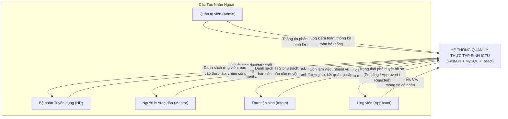
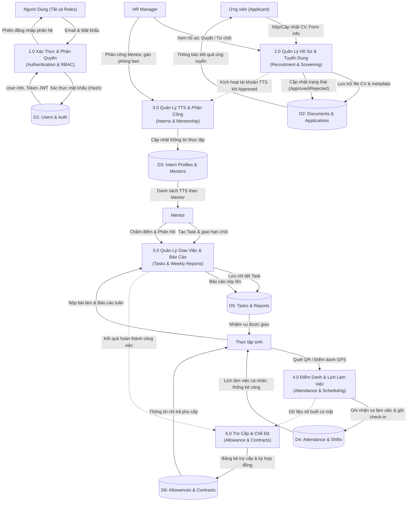
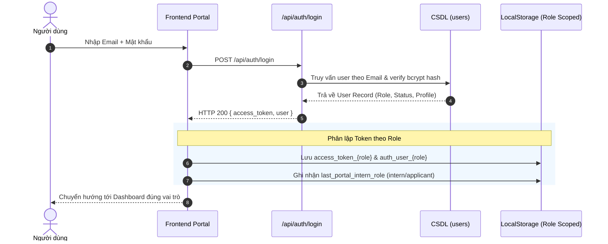
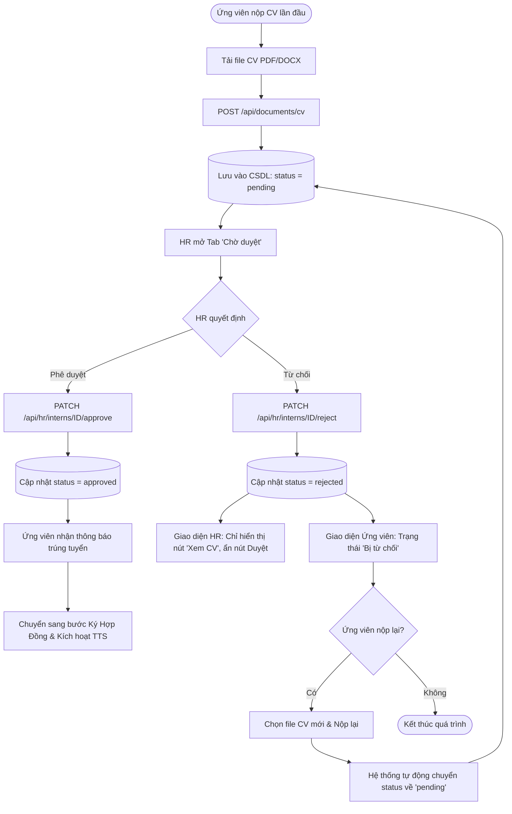
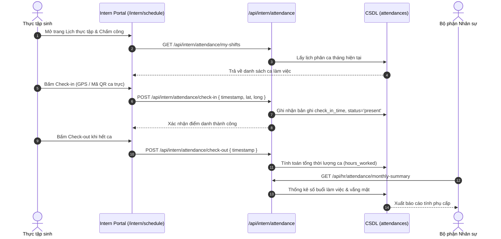
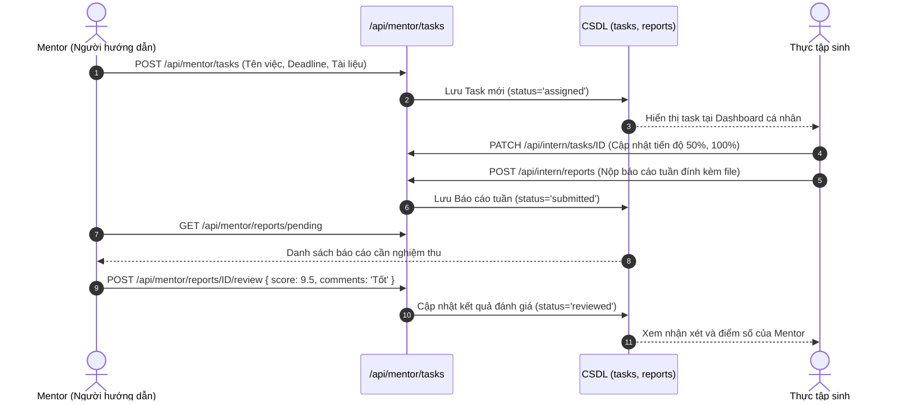

# SƠ ĐỒ LUỒNG DỮ LIỆU HỆ THỐNG (SYSTEM DATA FLOW DIAGRAM - DFD)
## Dự án: Hệ Thống Quản Lý Thực Tập Sinh ICTU (Product Backlog Internship)

---

## 1. TỔNG QUAN HỆ THỐNG & CÁC TÁC NHÂN (ACTORS)

Hệ thống quản lý thực tập sinh ICTU bao gồm 5 vai trò (Role-Based Access Control - RBAC):
1. **Admin (Quản trị viên)**: Quản lý người dùng, phân quyền, cấu hình hệ thống và danh mục phòng ban.
2. **HR (Bộ phận Nhân sự)**: Tiếp nhận hồ sơ, duyệt/từ chối ứng viên, quản lý thực tập sinh, tính phụ cấp/chế độ.
3. **Mentor (Người hướng dẫn)**: Phân công nhiệm vụ, đánh giá tiến độ, chấm điểm báo cáo hàng tuần của TTS.
4. **Intern (Thực tập sinh chính thức)**: Điểm danh, xem lịch thực tập, nhận task, nộp báo cáo, ký hợp đồng.
5. **Applicant (Ứng viên ứng tuyển)**: Nộp hồ sơ ứng tuyển (CV, thông tin cá nhân), theo dõi trạng thái duyệt, nộp lại CV nếu bị từ chối.

---

## 2. SƠ ĐỒ NGỮ CẢNH (DFD LEVEL 0 - CONTEXT DIAGRAM)

Sơ đồ mô tả luồng trao đổi dữ liệu tổng thể giữa Hệ thống Portal Thực tập sinh ICTU và các tác nhân bên ngoài.

---

## 3. SƠ ĐỒ PHÂN RÃ CHỨC NĂNG (DFD LEVEL 1)

---

## 4. CHI TIẾT CÁC LUỒNG DỮ LIỆU CHÍNH (DFD LEVEL 2)

### 4.1. Luồng Xác Thực & Tách Biệt Phiên Đăng Nhập (Auth & Multi-Portal Isolation)

Cơ chế phân tách phiên đa vai trò (Multi-tab isolation): Mỗi portal lưu trữ token và thông tin người dùng riêng biệt (`access_token_hr`, `access_token_intern`, `access_token_applicant`) nhằm chống ghi đè khi mở nhiều tab đồng thời.

---

### 4.2. Luồng Nộp Hồ Sơ, Xét Duyệt & Nộp Lại CV (Recruitment Lifecycle)

Xử lý vòng đời ứng viên: Nộp CV $\rightarrow$ Chờ duyệt $\rightarrow$ HR duyệt hoặc từ chối $\rightarrow$ Nếu bị từ chối, ứng viên có thể cập nhật CV mới và nộp lại.

---

### 4.3. Luồng Quản Lý Điểm Danh & Lịch Thực Tập (Attendance & Schedule)

---

### 4.4. Luồng Phân Công Công Việc, Báo Cáo Tuần & Đánh Giá (Tasks & Reports)

---

## 5. MA TRẬN DỮ LIỆU & ENDPOINT BẢO VỆ (API DATA MATRIX)

| Thực thể dữ liệu | Tác nhân chính | Phương thức & Endpoint | Quyền hạn (RBAC) | Mô tả xử lý dữ liệu |
|---|---|---|---|---|
| **Users / Auth** | Mọi vai trò | `POST /api/auth/login` | Public | Xác thực thông tin, trả về JWT token |
| **Documents / CV** | Applicant / Intern | `POST /api/documents/cv` | Applicant / Intern | Upload file hồ sơ CV lên hệ sinh thái |
| **Candidate Approval**| HR | `PATCH /api/hr/interns/{id}/approve` | HR, Admin | Đổi trạng thái ứng viên thành Approved |
| **Candidate Reject**  | HR | `PATCH /api/hr/interns/{id}/reject`  | HR, Admin | Đổi trạng thái thành Rejected, khóa thao tác duyệt lại |
| **Attendance** | Intern | `POST /api/intern/attendance/check-in`| Intern | Ghi nhận thời gian và tọa độ check-in |
| **Schedule Events** | Intern | `GET /api/intern/schedule` | Intern | Trả về danh sách ca làm việc và workshop |
| **Tasks Assignment**| Mentor | `POST /api/mentor/tasks` | Mentor | Tạo và giao task cho TTS trực thuộc |
| **Weekly Reports** | Intern / Mentor | `POST /api/intern/reports` | Intern | TTS nộp báo cáo tiến độ Sprint / tuần |
| **Allowances** | HR | `GET /api/hr/allowances` | HR, Admin | Tính toán phụ cấp dựa trên dữ liệu chuyên cần |

---

## 6. NGUYÊN TẮC BẢO MẬT & ĐẢM BẢO TOÀN VẸN DỮ LIỆU

1. **Phân quyền tại 2 lớp (Dual-Layer RBAC)**:
   - **Frontend**: Điều hướng Router Guard theo vai trò, tự động chuyển hướng nếu không đúng phân hệ.
   - **Backend**: FastAPI `Depends(get_current_active_user)` bắt buộc kiểm tra `role` trong payload của JWT Token cho từng endpoint.
2. **Xử lý Race-Condition & Cache Token**:
   - `client.js` tự động cấp phát token mới theo vai trò đích (`acquireTokenForRole`) khi phát hiện token hết hạn hoặc gặp lỗi 401/403.
   - Ngăn chặn triệt để lỗi ghi đè profile giữa ứng viên (`ungvien@ictu.edu.vn`) và thực tập sinh chính thức (`intern@ictu.edu.vn`).
